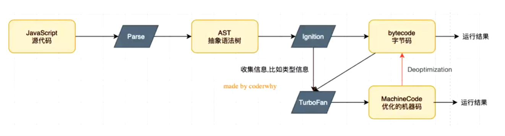
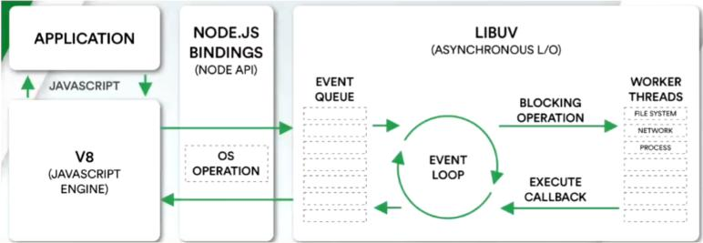

# 邂逅 NodeJs

## 一、思考

1. 什么是 JavaScript 运行环境
2. 为什么 JavaScript 运行需要特定环境呢？
3. 什么是 JavaScript 引擎
4. 什么是 V8 引擎

## 浏览器内核

我们常说的浏览器内核指的都是浏览器的排版引擎也称之为 Layout engine，是浏览器负责绘制和渲染页面的引擎，比如：

1. FireFox 浏览器内核：Gecko
2. IE 浏览器内核：Trident，从 Edge 开始已经弃用转而使用 blink1
3. safari：webkit 内核
4. chrome：Blink 内核，是 webkit 内核的一个分支
5. Opera：目前也采用 Blink 内核

实际上上面这种说法不全面，以 webkit 内核为例，真正的 webkit 内核应该包含两部分：

1. Webcore：负责解析 html、布局、绘制和渲染工作
2. JavaScriptCore:负责解析和执行 JavaScript 代码

我们常说的 webkit 内核是排版引擎的这种说法应该是片面的，这里再举一个微信小程序运行原理的例子。
微信小程序其实也是由两部分组成的：渲染层和逻辑层，渲染层基于 webview 实现，逻辑层基于 JSCore 实现。

## 为什么需要 JavaScript 引擎？

我们编写的 JavaScript 代码，无论是在浏览器环境还是 Node 环境执行，其实最终都需要被计算机的 CPU 执行的。但是 CPU 只认识自己的指令集，也就是机器语言才可以被 CPU 正确执行，而 JavaScript 语言是一种高级语言，要将高级语言解释为汇编语言，然后进一步转化为机器语言交由 CPU 执行，这个工作就需要 JavaScript 引擎来实现，目前常见的 JavaScript 引擎有：

1. JavaScriptCore
   苹果公司开发，使用于 safari 浏览器作为 webkit 内核的 JavaScript 引擎

2. V8
   Google 公司开发的强大的 JavaScript 引擎

3. SpiderMonkey
   第一款 JavaScript 引擎，由 JavaScript 的创始人 Brendan Eich 开发

## 什么是 V8 引擎

### 定义

下面是官方对于 V8 引擎的定义，至少说明了 V8 的一些主要特点：

1. V8 是谷歌浏览器内核的名称，它本身是基于 C++编写的由 Google 开源的高性能的 JavaScript 和 WebAssembly 引擎，这意味着它不仅可以解析执行 JavaScript 代码，还可以执行 WebAssembly 汇编代码

2. V8 引擎目前多用于浏览器和 Nodejs 这些应用程序中，提供解析执行 JavaScript 代码的功能

3. V8 引擎可以跨系统运行，比如在 win7+、macos10.12+以及 linux 系统上运行

4. V8 引擎是独立的，可以嵌入到任意 C++编写的应用程序中，比如 Node.js 这个应用程序内部就嵌入了 V8 引擎来实现解析和执行 JavaScript 代码的功能

### V8 引擎原理

1. Parse 解析器
   V8 的 Parse 模块会将 JavaScript 代码转化为抽象语法树，之所以需要转化为 AST 是因为 V8 的解释器并不认识 JavaScript 代码。

2. Ignition 解释器
   Ignition 是 V8 内部的解释器，负责将上一步转化的 AST 进一步解释转换为 ByteCode 字节码。
   在这个过程中会收集 TurboFan 优化所需要的信息，比如函数参数的类型信息

3. TurboFan 编译器
   TurboFan 编译器负责将字节码编译为 CPU 可以直接执行的机器码。
   如果一个函数被多次调用那么就会标记为热点函数，此时 TurboFan 编译器就会将这个热点函数代码直接转化为机器码，而省略中间将字节码转化为机器码的这一过程，提高运行效率
   但是，有的时候机器码也会被还原为字节码，比如后续执行该热点函数的过程中函数参数的类型发生了变化，此时会进行反优化将之前编译优化后的机器码再逆向转化为字节码。

4. Orinoco 垃圾回收器
   负责自动垃圾回收的模块，也是 V8 引擎高效的原因之一

## Node

1. 官方定义
   Node.js 是一个基于 V8 JavaScript 引擎的 JavaScript 运行时环境。

2. Node 的组成
   Node.js 是使用 V8 引擎来解析和执行 JavaScript 代码的，但是 Node.js 作为一款应用程序来说，它可不仅仅只有 V8 引擎。
   就和浏览器一样，浏览器除了可以解析执行 JavaScript 代码之外的 V8 引擎之外，还有用于解析 HTML 和 CSS 代码的排版引擎，除此之外浏览器还使用中间层来和操作系统进行交互，比如发送网络请求需要和网关进行交互，写入数据的时候需要和系统硬盘进行交互等等。

对于 Node 来说，它除了基于 V8 解析执行 JavaScript 代码之外，也具有一个中间层 libuv，基于中间层来和系统进行操作，比如常见的文件读写、网络 I/O、加密以及压缩传输文件等。

3. Node 架构

- V8 引擎：基于 C++编写，用于解析 JavaScript 代码
- NodeJS Bindings：使用 JavaScript 编写，主要提供 Node 全局 Api
- Libuv：基于 C 语言编写，提供核心的事件循环、文件系统读写、网络 IO 以及线程池等内容，主要和操作系统进行交互

## REPL

Read Eval Print Loop:读取 - 执行 - 输出 循环
和浏览器的控制台一样可以提供一个简单的编程环境
