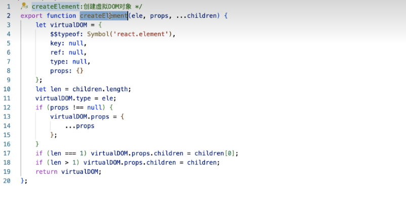
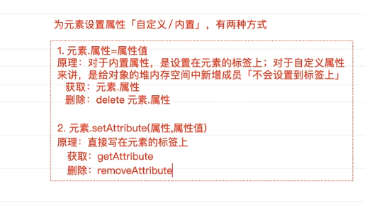

# JSX

这部分的流程搞懂了：

1. 可以在面试中说出来流程
2. 后续在进行手写 React 的时候写出来即可
3. 不浪费太多时间在这个上面

4. 通过 JSX 语法来描述 UI 结构，简单
5. 通过 API 来描述，也就是 React.createElement 函数来描述，复杂

JSX 一定会通过 babel 转化为 React.createElement 函数调用的形式
React.createElement 函数调用会返回一个 js 对象
这个对象就是虚拟 DOM 对象

JSX 语法 => JS 对象的映射
JS 对象来描述了 UI 结构

reateElement(type, props, ...children)

type：

1. 一个 html 元素的 tag
2. 一个函数式组件 以<Home/>
3. 一个类组件 以</About>
4. 一个特殊的组件 Fragment

props:

1. null 为空对象处理
2. js 对象
   - className
   - style
   - 原生属性
   - ref
   - key

children：零个或多个 React 节点

1. React 元素 也就是任意一个通过 React.createElement 创建出来的虚拟 dom 对象
2. 任意一个字符串
3. 任意一个数字
4. 空节点 null undefiend true 和 false
5. Portal 组件

上述的子节点可以是一个，也可以用数组表示多个

返回的是一个 React 元素，也称之为虚拟 DOM 对象

1. type 属性
2. ref 属性
3. key 属性
4. props 属性
   - className
   - style
   - 其他 dom 属性
   - children
     - {同上}

最终拿到一颗根虚拟 DOM 对象
将这个对象交给 ReactDom.render 方法渲染
render(reactNode, domNode, callback?)

reactNode

1. 可以是一个 Jsx 编译之后得到的是虚拟 dom 对象 </Home> => 虚拟 DOM 对象
2. 可以直接是一个虚拟 dom 对象
3. 可以是字符串 数字等

domNode：就是 DOM 元素
React 将管理 domNode 中的 DOM，并会在 React 树发生变化时更新它。

返回值：

1. null
2. 类组件会返回该组件的实例

第一次渲染：

1. 先把所有 DOM 中内容清空
2. 然后将真实 DOM 渲染上去，无非就是递归的拿到 reactNode 的 js 对象，递归调用 DOM API 生成元素、属性、样式并 append 或者 insert 的操作

后面渲染：

1. 先拿到旧的虚拟 dom
2. 拿到新的虚拟 dom
3. diff 算法进行前后对比？如何对比？前后 后前？
4. 获取到 diff 的部分
5. 再次将 diff 的部分调用 DOM API 渲染到页面上
6. 没有 diff 的不动

## 手写一个 RC 函数

## JSX 还可以直接嵌入 RC 函数返回的 js 对象

{RC()}

## 给元素设置的属性的方式

## 16 18 区别

ReactDom.render(<App></App>,document.getElementById("root"))

const root = ReactDOM.createRoot(document.getElementById("root"));
root.render(<App></App>);
