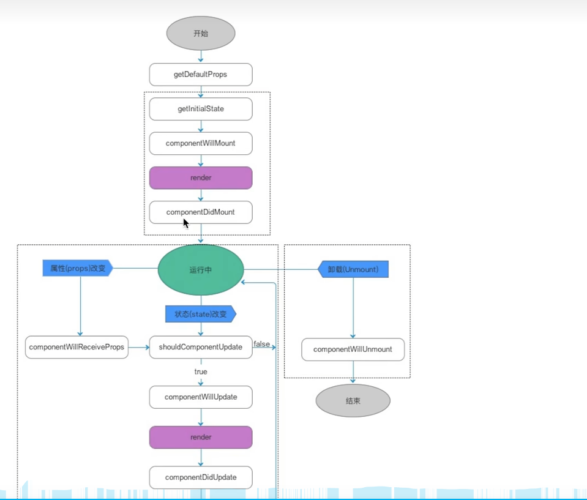
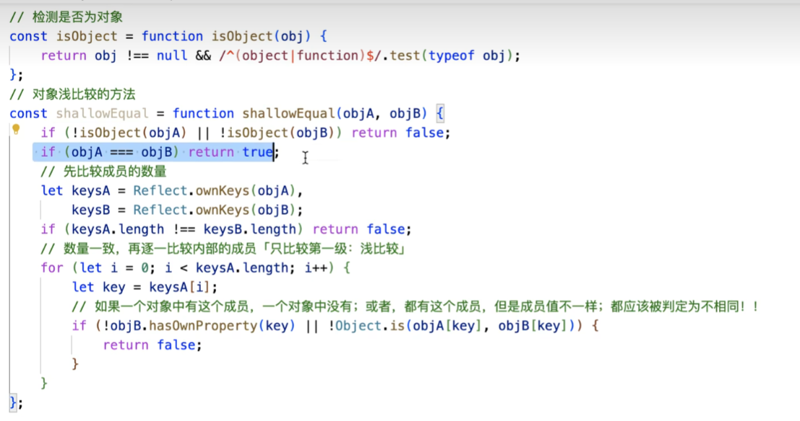

## 函数式组件渲染逻辑

1. 基于 babel-preset-react 将调用的组件转化

```jsx
function Home(props) {
  console.log(props);
  return (
    <div>
      <h1>你好啊{props.name}</h1>
      <h2>你今年{props.age}岁</h2>
    </div>
  );
}
```

转化为：

```ts
React.createElement(Home, {
  name: "lilei",
  age: 18,
  className: "home-class",
  style: {
    color: "pink",
    fontSize: "20px",
  },
});
```

2. 执行上一步的 React.createElement，将会返回一个组件的虚拟 Dom，注意组件的虚拟 DOm 中 type 不再是字符串，而是一个函数 Home，props 包含所有组件调用时传递的属性

```ts
{
    $$typeof:Symbol(react.element)
    key:null
    props:{name: 'lilei', age: 18, className: 'home-class', style: {…}}
    ref:null
    type:ƒ Home(props)
}
```

3. 执行 type 中的函数 Home，将 props 传入，最终得到组件 Home 当中包裹的元素的虚拟 dom，此时虚拟 dom 中的 type 才是可以供浏览器渲染的 html 元素 tag，最终调用 render 函数将虚拟 dom 渲染为真实 dom

4. 如果组件在调用的时候传入了子元素，那么组件的虚拟 dom 对象的 chidlren 属性上就挂载着所有子元素的虚拟 dom 对象

```tsx
<Home
  name="lilei"
  age={18}
  className="home-class"
  style={{
    color: "pink",
    fontSize: "20px",
  }}
>
  <h1>子元素1</h1>
  <h1>子元素2</h1>
</Home>
```

此时组件的虚拟 dom 为：

```ts
{
    $$typeof:Symbol(react.element)
    key:null
    props:{name: 'lilei', age: 18, className: 'home-class', style: {…}}
    ref:null
    type:ƒ Home(props),
    chidlren:[
        {...},
        {...}
    ]
}
```

## 如何让对象不可设置

1. 冻结
   Object.freeze() 不可修改和删除 不能新增成员 不能劫持 get 和 set

2. 密封
   Object.seal()
   Object.seal() 不可以从外部新增或者删除 但是内部可以修改 不能劫持 get 和 set

3. 不可拓展
   Object.preventExtensions()
   Object.preventExtensions 不可以新增 但是可以删除 修改或者劫持

## React 中的插槽

1. props.children
2. key-value key 就是插槽 name value 就是插槽的结构 jsx 通过 props 获取结构

## React.Children API

 <div>
      {props.children.map((child, index) => {
        return (
          <div key={index} className="rowItem">
            {child}
          </div>
        );
      })}
</div>

如果父组件没有传入插槽，那么这里的 props.children 就是一个 undefined，如果在子组件中调用 map 方法就会报错

### 暴露的 API

- Children.only(children) 判断当前元素是否为一个 React 元素 如果是返回元素 否则报错
- Children.count(children) 统计个数
- Children.toArray(children) 转化为数组 包含了 null undefined 的情况兼容 并且重新计算了 key
- Children.map(children,(child,index)=>{}) 映射
- Children.forEach(children,(child,index)=>{}) 遍历

### 用法

1. 对 children 进行转化 比如将子节点数组进行 map
2. 对 children 每个子元素执行一段代码
3. 统计子节点
4. 将 children 转化为数组

### 注意

1. 下面这种情况父组件 App 中虽然传递了两个插槽，但是在 App 组件内部的 props.children 上只能接受到 h1 节点和 Home 节点自身暴露出来的节点，因为 Home 组件内部还通过计算得到了两个节点 div 和 span 元素，但是最终 App 渲染的结果中只会有 h1 和 Home 组件天然的 div，而不会有 span 元素，当操作 children 时，我们没办法获取到像 <Home /> 这样的内部组件的渲染输出结果

```jsx
<App>
  <h1></h1>
  <Home>
     <h2>这是Home的子节点</h2>
  </Home>
</App>

function Home({children}){
  return (<>
    <div>这是Home的结构</div>
    <span>{children}</span>
  <>)
}
```

### 代替方案

1. 直接暴露多个组件
2. 接受对象数组
3. 调用函数来进行自定义渲染

## 具名插槽

```ts
class App extends React.Component {
  render() {
    return (
      <>
        <RowList>
          <div slot="header">header</div>
          <div>main</div>
          <div slot="footer">footer</div>
        </RowList>
      </>
    );
  }
}
```

```ts
function RowList(props) {
  console.log(props.children);
  let { children } = props;
  children = Children.toArray(children);

  let defaultSlot = [];
  let headerSlot = [];
  let footerSlot = [];

  children.forEach((child) => {
    const { slot } = child;
    if (slot === "header") {
      headerSlot.push(child);
    } else if (slot === "footer") {
      footerSlot.push(child);
    } else {
      defaultSlot.push(child);
    }
  });

  return (
    <div className="rowList">
      {headerSlot}
      {defaultSlot}
      {footerSlot}
    </div>
  );
}
```

## 函数式组件的静态组件特点

组件第一次渲染完毕之后再去修改组件内部的状态，状态变了但是组件不会重新渲染这是因为：

函数首次渲染：

1. 创建函数执行作用域
2. 获取到 props 属性然后冻结起来
3. 执行函数拿到返回的虚拟 dom 对象
4. render 这个虚拟 dom 为真实 dom

函数内部状态变化：

1. 函数作用域中私有变量发生变化
2. 但是由于 props 外界没有变化 所以函数不会重新渲染

要想渲染：

1. props 传入新的值
2. 手动获取到引用 ref 调用 render 函数

## React 中的动态组件

1. 类组件
2. Hooks 组件

动态组件的特点是首次渲染完成之后后续如果修改内部的状态比如 state 或者 props 都会触发组件的重新渲染和视图的更新

## 类组件

class 内部通过：
constructor 中显式 this.xxx 赋值的是实例属性和方法
类的顶级作用域中 this.xxx 赋值的也是 不管是普通函数还是箭头函数 其内部 this 都是实例
类的顶级作用域中直接 ES6 简写的方法比如：

```ts
class A {
  run() {}
}
```

这个 run 方法就是原型链上的公有方法，而不是实例的。

static 就是给类本身设置的静态属性和方法

## React 中类组件的继承原理

### call 继承

1. class Home extends Component 是基于 call 实现继承的，也就是在内部通过：

```ts
React.Component.call(this);
```

执行 React.Component 函数，并将子类的 this 传递过去，在 React.Component 内部：

```ts
function Component(props, context, updater) {
  this.props = props;
  this.context = context; // If a component has string refs, we will assign a different object later.

  this.refs = emptyObject; // We initialize the default updater but the real one gets injected by the
  // renderer.

  this.updater = updater || ReactNoopUpdateQueue;
}
```

这里执行 Component，但是在执行的时候让内部的 this 指向我们传入的子类实例，这不就会给创建出来的 Home 类的实例上添加了四个私有属性：

1. props
2. context
3. refs
4. updater

可以看出 Component 的原型上还有这些方法：

1. isReactComponent
2. setState
3. forceUpdate

### 基于原型继承

内部会实现：
Home.prototype.**proto** = React.Component.prototype

在 Home 内部写 this.xxx 的时候：

1. 先去 Home 实例上找 这一步可以找到自己定义的私有属性和方法
2. 再去 Home.prototype 上找，可以找到自己定义的共有方法 比如 ES6 简写的方法
3. 再去 React.Component.prototype 父类原型对象上找
4. Object.prototype 上找

### super

可以不写 constructor
如果写了 那么必须写 super()
super 是父类，也就是这里的 React.Component
并且 ES6 规定 super 执行等于 React.Component.call 执行
并且将 this 指定为当前类的实例 this

super(...args)
args 就会传递给父类 React.Component 函数的 props 参数，所以最终实例化出来的 this 上就会有 props 属性

如果不写 React 就默认执行了：

```ts
class Home extends Component {
  constructor(props) {
    super(props);
  }
}
```

默认会将传递给 Home 组件的 props 实例化后挂载再 Home 的实例上

## 类组件的渲染原理

1. 基于 babel-preset-react 将调用的组件转化

```jsx
import React from "react";
class Home extends React.Component {
  state = {
    counter: 0,
  };

  render() {
    return (
      <>
        <div>{this.state.counter}</div>
        <button>+</button>
      </>
    );
  }
}
```

转化为：

```ts
class Home extends React.Component {
  state = {
    counter: 0,
  };

  render() {
    return React.createElement(
      React.Fragment,
      null,
      React.createElement("div", null, this.state.counter),
      React.createElement("button", null, "+")
    );
  }
}
```

1. 执行上一步的 React.createElement，将会返回一个组件的虚拟 Dom，注意组件的虚拟 DOm 中 type 不再是字符串，而是一个 class 类，props 包含所有组件调用时传递的属性
   注意 ES6 中的类本质也是一个函数

```ts
{
    $$typeof:Symbol(react.element)
    key:null
    props:{name: 'lilei', age: 18, className: 'home-class', style: {…}}
    ref:null
    type:class Home
}
```

3. 通过 new 操作符调用类 Home，将 props 传入，最终得到一个 Home 类的实例。类似于：

```ts
new Home(props);
```

4. 默认调用一次实例上的 render 方法，得到一个组件 Home 当中包裹的元素的虚拟 dom，此时虚拟 dom 中的 type 才是可以供浏览器渲染的 html 元素 tag，最终调用 render 函数将虚拟 dom 渲染为真实 dom

5. 如果组件在调用的时候传入了子元素，那么组件的虚拟 dom 对象的 chidlren 属性上就挂载着所有子元素的虚拟 dom 对象

```tsx
<Home
  name="lilei"
  age={18}
  className="home-class"
  style={{
    color: "pink",
    fontSize: "20px",
  }}
>
  <h1>子元素1</h1>
  <h1>子元素2</h1>
</Home>
```

此时组件的虚拟 dom 为：

```ts
{
    $$typeof:Symbol(react.element)
    key:null
    props:{name: 'lilei', age: 18, className: 'home-class', style: {…}}
    ref:null
    type:ƒ Home(props),
    chidlren:[
        {...},
        {...}
    ]
}
```

## 类组件渲染流程

1. 先进行属性 props 的规则校验

```ts
// 默认值
  static defaultProps = {

  }

// 属性校验规则
  static propTypes = {

  }

```

2. 初始化属性 props
   如果用户在 constructor 中手动调用了 super 并传入了 props 属性，那么 React 会将 props 中的属性依次挂载到当前类的实例上，这个就是前面说的 call 继承

如果用户没有在 constructor 中手动执行 super 或者压根没有写 constructor，那么 React 会在 constructor 执行完毕之后将传递的 props 挂载到实例上，所以 render 函数中还是可以获取到父组件传递的 props 属性，但是注意此时在构造函数 constructor 中如果不手动 super 那么 props 的值就会是 undefined

3. 初始化状态 state
   这一步一般需要手动初始化 state 对象，可以在构造函数内部初始化也可以在类的顶级作用域初始化，如果不初始化那么 React 内部会自动给这个类的实例上挂载一个 state 属性，但是初始值就是 null

```ts
constructor() {
  super();
  this.state = {
    counter: 0,
  };
}

```

4. 执行生命周期函数 componentWillMount，表示组件即将挂载这个 API 未来将会被移除，控制台的黄色警告会出现，此时可以用 UNSAFE_componentWillMount 来替换，之后控制台就不会出现黄色警告，但是 UNSAFE_componentWillMount 在严格模式下也是不建议使用的，也就是 React.StrictMode，此时控制台会有红色警告，严格模式下会检查一些不规则的旧的语法和过期的 API

5. 执行 render 函数，这一步会得到虚拟 dom，并且转化为真实 dom 挂载在视图上

6. 生命周期函数 componentDidMount 触发，表示挂载完成

## React 完整的生命周期图



## React 类组件更新的流程

用户调用 setState 或者 forceUpdate 方法，或者父组件传递的 props 发生了变化，此时会首先会进行组件更新阶段

1. 如果是 props 的改变，会进入到生命周期函数 componentWillReceiveProps(nextProps, nextContext){}中，参数可以接受到新的 props 和新的上下文

2. 进入声明周期函数 shouldComponentUpdate(nextProps, nextState, nextContext),这个函数中可以拿到最新的 props，state 以及最新的上下文，如果返回 false 那么不进行更新，流程终止；返回 true 表示进入更新流程

- nextProps 新的属性对象 this.props 是旧的
- nextState 新的 state 状态 this.satte 是旧的

3. 触发 componentWillUpdate(nextProps, nextState, nextContext)函数，表示即将开始更新,这个函数也即将被移除，也有 UNSAFE 的版本

4. 执行 render 函数得到最新的虚拟 dom，会进行虚拟 dom 的 diff，得到差异的部分进行 patch 补丁操作，渲染变化的部分

5. 执行生命周期函数 componentDidUpdate(prevProps, prevState, snapshot)，此时 dom 已经是新的 dom 表示更新完成

如果是 setState 引起的更新，那么会直接从上面的第 2 步开始，流程基本一致
如果是 forceUpdate 进行更新的，无论 shouldComponentUpdate 中是否返回 false，都会强制进行更新的，也就是会直接跳过 shouldComponentUpdate 函数的执行

## 父子组件的生命周期流程

深度优先原则
父组件第一次挂载阶段：

1. 父组件的 willMount
2. 子组件的 willMount
3. 父组件开始 render
4. 子组件 render
5. 子组件 didMount
6. 父组件 didMount

深度优先原则，所有子组件处理完毕，父组件才可以宣布自己 didMount

父组件的更新阶段：

1. 父组件的 shouleUpdate，返回 false 直接结束，返回 true 进入下一步
2. 父组件的 willUpdate
3. 父组件的 render
4. 子组件 componentWillReceiveProps 首先执行 这一步会拿到前后的 props
5. 子组件的 shouleUpdate
6. 子组件的 willUpdate
7. 子组件的 render
8. 子组件的 didUpdate
9. 父组件的 didUpdate

我们可以在子组件 componentWillReceiveProps 中进行对比前后 props，如果变化了才去渲染，否则不渲染
React 的 memo 函数就是这个原理

父组件的卸载阶段：

1. 父组件的 willUnMount
2. 子组件的 willUnMount
3. 子组件释放
4. 父组件释放

## 动态组件和静态组件的区别

动态组件 代表是类组件

- 组件内部有属性 状态 ref 周期函数，不仅可以通过父组件更新而引起被动更新，还可以自己内部调用 api 主动更新
- 类组件功能强大，但是渲染性能比如函数组件

静态组件 代表是函数组件

- 组件只有 props 属性 无法实现内部的主动更新 但是可以通过父组件更新而被动更新，为了解决这个问题就有了 hooks 组件
- 函数组件机制简单，没有复杂的 this 绑定机制，这样的话函数组件渲染速度一定快

Hooks 组件 具备两者优势

- 既可以让函数有自己的状态，可以内部实现主动更新，而不是依靠父组件更新
- 也保证了函数式组件的所有优点，比如没有 this 绑定等优点

## Component 和 PureComponent 的区别

### PureComponent 是浅层比较

比如一个组件的 state 中有一个 arr 数组，初始是[1,2,3]，当我们继承 Component 的时候，我们点击某个按钮执行：
arr.push(100)
setState({
arr:arr
})

此时视图会更新渲染，因为 arr 数组中的值发生了变化

如果我们继承自 PureComponent 的时候，当我们执行上述一样的操作的时候，会发现视图并不会更新，这是因为 PureComponent 内部对比前后 state 的时候是浅层比较，一开始 arr 的内存地址假设是 001，push 了一个值以后数组 arr 的堆内存地址还是 001，PureComponent 认为没有更新状态所以就不会更新

那么我们该如何防止出现这种情况呢？
一个很好的方法是每次点击事件触发的时候先浅克隆一个数组，浅克隆的数组是新的内存地址，然后给这个浅克隆的数组 push 一个值，PureComponent 会发现前后的数组内存地址发生了变化，因此就会更新。

```ts
class Home extends React.PureComponent {
  constructor() {
    super();
    this.state = {
      counter: 0,
      arr: [1, 2, 3],
    };
  }

  click = () => {
    const cloneArr = [...this.state.arr];
    cloneArr.push(100);
    this.setState({
      counter: this.state.counter + 1,
      arr: cloneArr,
    });
  };
}
```

### PureComponent 会默认给组件添加一个 shouldComponentUpdate，所以继承了 PureComponent 就无需再实现 shouldComponentUpdate 函数了

PureComponent 在更新的时候就会调用 shouldComponentUpdate 函数拿到前后状态和属性进行对比，并且是浅层对比，也就是只对比对象的第一层属性，深层的不会进行对比

- 如果属性值是基本值，那么对比值是否相等
- 如果属性值是引用值，那么对比值的引用地址是否相等，至于引用值内部的更深层次的属性就不进行对比了

其实就是在 shouldComponentUpdate 中实现了一个新旧 state 和 props 的浅层比较方案

## 对象浅比较的实现


在源码阶段补充

## 对象深比较的实现

- 需要考虑更多的可能
- 需要递归调用方法来一层层的比较

## 组件的 Ref

受控组件：

- 基于 React 的 setState 方法来修改状态让视图进行更新
- state 成为唯一数据源

非受控组件：

- 基于 createRef 来操作真实 dom 进行视图更新

### 类组件的 ref 获取

每一个组件或元素的虚拟 dom 一定会有一个 ref 属性来标识当前组件或元素的 dom 引用：

1. 如果用户传入的 ref 是 null，那么不进行处理
2. 如果 ref 是一个字符串，那么给当前组件实例的 this.$ref 上增加一个成员，将 dom 对象或者组件实例赋值过去，不建议使用严格模式下会报错
3. 如果 ref 是一个 createRef 创建出来的对象比如 xxxRef，那么会给拿到这个对象 this.xxxRef，然后给这个对象的 current 属性赋值为 dom 对象或者组件实例
4. 如果 ref 是一个函数，那么会执行这个函数，并且将 dom 对象或者组件实例当做参数传递给这个函数，至于函数内部的逻辑是开发者自己定义的

### 函数式组件的 ref 获取

函数式组件无法直接设置 ref，可以使用 React.forwardRef API 来进行 ref 的转发，这样就以获取到函数组件内部的某个元素 dom

```tsx
class App extends React.Component {
  homeRef = null;
  render() {
    return;
    <Home ref={(homeRef) => (this.homeRef = homeRef)}></Home>;
  }

  componentDidMount() {
    console.dir(this.homeRef);
  }
}
```

函数组件 Home 内部：

```tsx
import React from "react";
export default React.forwardRef(function Home(props, ref) {
  return (
    <>
      <div ref={ref}>哈哈哈</div>
    </>
  );
});
```
