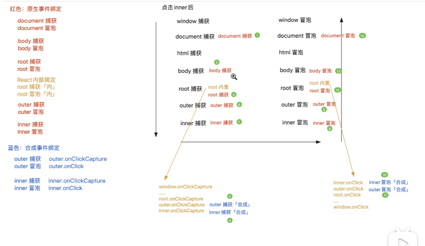
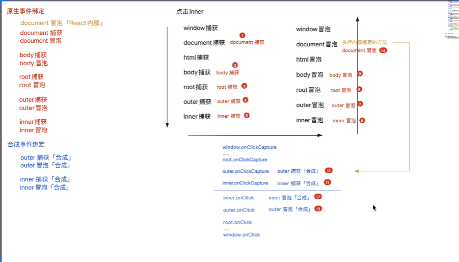

# React 中的合成事件 (Synthetic Event)

## 简介

React 的合成事件（Synthetic Event） 是 React 团队围绕浏览器的原生事件，创造出的一个跨浏览器行为的事件对象。合成事件可以将不同浏览器的行为合并为一个 API，从而确保 React 中的事件在不同浏览器中保持一致的行为。

合成事件是 React 经过处理之后得到的新的事件对象，里面既包含了原生事件对象 nativeEvent，也包含了一些常见的事件有关的属性和方法。

## 语法：如何在 JSX 中绑定合成事件？

在 JSX 元素上，直接基于 on 开头绑定的事件内部都会经过合成事件的处理。合成事件绑定的事件处理函数一般有三种写法：

1. bind 写法，手动改写了 this 为类组件实例
2. 类私有箭头函数写法，this 永远是类组件实例
3. 类原型方法写法，默认 this 是 undefined

```tsx
<button onClick={this.btnClick1}>绑定事件</button>
<button onClick={this.btnClick2.bind(this)}>绑定事件</button>
<button onClick={this.btnClick3}>绑定事件</button>

btnClick1(e){}
btnClick2(e){}
btnClick3 = (e)=>{}
```

## 原生 DOM 事件传播机制

### 1. 原生 DOM 事件的传播顺序

1. 先进入捕获阶段
   从顶级到目标元素，这个阶段通过 addEventListener(type, listener, useCapture)方法绑定并且第三个参数 useCapture 为 true 的 listener 会依次触发
2. 到达目标元素，进入目标阶段
   这个阶段会获取到事件源，并将对应的事件触发

3. 进入冒泡阶段
   从当前元素到顶级元素，这个阶段通过 addEventListener(type, listener, useCapture)方法绑定并且第三个参数 useCapture 为 false 的 listener 会依次触发
   冒泡阶段可以采用 event.stopPropagation()来阻止事件传播

### 2. addEventListener 函数的特点

1. 可以为一个相同的事件添加多个 listener
2. addEventListener 函数中的 useCapture 的意思是是否使用捕获阶段触发，默认为 flase 也就是冒泡阶段触发，可以手动指定为 true 表示捕获阶段触发
3. addEventListener 会将 listener 添加到调用它的事件源指定类型的 listener 队列中，已经添加过的 listener 不会被重复添加
4. addEventListener 的第三个参数也可以是一个对象 options，其中的参数为：
   - once 表示只触发一次后不再触发
   - capture 表示是否在捕获阶段触发
   - passive 表示 listener 永远不会调用 preventDefault() 如果强行调用就会控制台抛出异常
   - signal：值是一个 AbortSignal 类的实例，实例的 abort 调用时监听器会被移除

### 3. 事件和事件处理函数

事件是浏览器默认行为，任何元素都可以触发事件，但是如果没有绑定对应的事件处理函数，那么就不会有任何行为而已

### 4. event.stopPropagation()

event.stopPropagation()更加准确的说应该是阻止事件流的传播，如果我们在 body 的捕获阶段绑定一个事件，然后调用这个 event.stopPropagation()，那么事件压根就不会再向更加里面的地方传播。

这说明 event.stopPropagation()不仅可以阻止事件冒泡，而且可以阻止事件捕获，事件走到这里就终止了，不会再有后续的传播动作了。

### 5. event.stopImmediatePropagation()

event.stopImmediatePropagation 的作用在于：

1. 和 stopPropagation 一样阻止事件流的传播
2. 对于同一个 dom 元素绑定了相同类型的多个事件处理函数，比如一个 div 绑定了 3 个 click 点击事件的处理函数，只要在任意一个事件处理函数内部调用 stopImmediatePropagation 方法，那么该 dom 元素绑定的点击事件的其他 listner 都不会再执行
3. 而对于 stopPropagation 来说，一个 dom 元素绑定相同类型的多个事件处理函数 listener，就算其中一个调用了 stopPropagation 方法，那么该 dom 元素绑定的其他 listner 还是会执行

### 6. 事件委托机制

事件委托机制是基于浏览器的事件传播机制实现的一套优化事件绑定的方案，比如：

1. 一个页面上有 100 个 li 都需要绑定点击事件
2. 每一个点击事件触发后都需要获取到元素的 index 传递给外部

传统的解决方案是循环 li，然后依次绑定，这样会绑定 100 个 listener，也就是分配 100 个堆内存去处理，并且多数逻辑是类似的，代码没有复用；
而基于事件委托机制，可以只在顶层的 ul 元素上绑定一个事件，基于 event.target 可以获取到点击的事件源 dom 元素，这样子只用绑定 1 个 listener，是更加优秀的事件绑定方案，性能上也比较好

事件委托机制的使用场景是：

1. 页面上有 10 个 tab，点击其中一个变为高亮，其他的 9 个全部变为置灰，此时就可以在顶层绑定事件，只要事件触发就先将所有都置灰，然后给当前点击的元素高亮
2. 页面上的元素是动态删减的，我们不用每次为新增的元素绑定事件，而是可以直接在顶层绑定事件直接处理

事件委托机制的缺点是：

1. 当前操作的事件必须支持冒泡传播机制，因为有的事件不支持冒泡传播
2. mouseenter 和 mouseleave 事件是没有事件冒泡阶段的
3. 如果单独的事件绑定中手动调用 stopPropagation 阻止了事件传播，那么无法使用事件委托

## React18 事件合成机制原理



### 概述

当我们在 JSX 为元素绑定诸如 onClick 或者 onClickCapture 的合成事件的时候，其实 React 内部并不会真正的去为元素做 DOM 0 级或者 DOM 2 级的 addEventListner 的操作，而是经过了下面的内部处理：

1. 先给 JSX 中的 dom 元素设置 onClick 和 onClickCapture 的属性，注意这只是给 dom 元素添加属性并不是事件绑定
2. 基于事件委托机制在 React App 的顶级元素也就是 id 为 root 的元素上绑定捕获阶段和冒泡阶段的原生事件处理函数
3. 当 JSX 上的元素触发事件后，根据事件委托机制会首先触发 root 元素的捕获阶段的事件处理函数，在此函数内 React 会基于事件处理对象中的 path 属性获取到事件传播路径，然后依次取出这些 dom 元素上的 onClick 和 onClickCapture 的属性，然后依次执行
4. 在冒泡阶段同理，原理和捕获阶段一样
5. React 还会对原生的事件对象进行处理，返回一个合成事件对象然后当做参数传递给 onClick 和 onClickCapture 属性绑定的函数

### 合成事件原理简单实现

```ts
root.addEventListener(
  "click",
  (ev) => {
    const eventPath = ev.path || (ev.composedPath && ev.composedPath());
    [...eventPath].reverse().forEach((el) => {
      const captureHandler = el.onClickCapture;
      /**
       * 1. 这里的事件对象应该是合成事件对象
       * 2. 这里的事件处理函数在执行时的this时undefined 所以jsx中onCLick绑定的普通函数就是this
       */
      captureHandler && captureHandler(ev);
    });
  },
  true
);

root.addEventListener(
  "click",
  (ev) => {
    const eventPath = ev.path || (ev.composedPath && ev.composedPath());
    [...eventPath].forEach((el) => {
      const handler = el.onClick;
      handler && handler(ev);
    });
  },
  false
);
```

### 合成事件注意点

1. 基于原生事件的事件委托机制，所有 React app 内部元素绑定的事件都被委托到 root 根元素上处理

2. React17 以后的版本，都是委托为#root 这个容器，冒泡和委托同时做了委托；而 React17 以前的版本，都是委托给 document 元素，并且只对冒泡阶段做了委托

3. 对于没有事件传播机制的事件，便只能做 dom 2 级的绑定而不做合成事件的处理，比如 onMouseenter 和 onMouseLeave

4. React 内部对于相同元素的合成事件处理总是先于 dom 原生事件处理，也就是假设 root 的冒泡触发，会先执行基于 root 冒泡委托的子元素的合成事件，执行完成之后才去执行自身的原生 dom 绑定事件

## 合成事件对象 SyntheticBaseEvent 

### stopPropagation 和 native.stopPropagation

合成事件对象 ev.stopPropagation 目的是既阻止合成事件传播，又阻止原生事件传播
原生事件对象 ev.native.stopPropagation 只能阻止原生事件传播

### 事件处理池

当每一次事件触发之后，都会委托到 document 元素或 root 元素的事件处理函数中，在委托的方法内部会首先基于本次操作的事件做统一的处理，然后得到一个合成事件对象。

但是在 React16 中，是做了事件处理池和缓存机制优化的：为了防止每一次都是创建出一个新的合成事件对象，它会设置一个事件对象池，每当事件触发先获取事件信息，然后从事件对象池中获取存储的合成事件对象，然后依次将信息赋值给这个合成事件对象；当事件处理结束之后，就将之前赋值的全部清空为 null，然后重新放入到事件对象池中。

这样做的优点是提高了性能，避免了重新创建对象，缺点是在事件处理程序中异步获取事件对象的话所有成员信息都是 null，为了解决这个问题，我们可以调用合成事件对象上的 e.persist()方法，表示让合成事件对象持久化存在。

在 React18 中，并没有做事件处理池和缓存机制的，所以也就不存在异步去获取事件对象不存在的情况。

## React16 合成事件处理机制的区别



1. React16 事件委托的目标元素是 doucment 元素，而不是#root 元素
2. React16 只在绑定了 document 冒泡阶段的事件委托，捕获阶段的没有处理
3. 在委托的方法中，把 onXXX 合以及 onXXXCapture 合成事件属性一起进行执行，这个原理是和 18 一致的，但是 18 中是分开的

```ts
doucment.addEventListener(
  "click",
  (ev) => {
    /* path总是从点击具体元素开始 -> document元素 */
    const eventPath = ev.path || (ev.composedPath && ev.composedPath());

    // 把捕获阶段的合成事件执行
    [...eventPath].reverse().forEach((el) => {
      const captureHandler = el.onClickCapture;
      captureHandler && captureHandler(ev);
    });

    // 把冒泡阶段的合成事件执行
    eventPath.reverse().forEach((el) => {
      const handler = el.onClick;
      handler && handler(ev);
    });
  },
  false
);
```

## 移动端 click 和 web 端的 click 事件

### 区别

1. 移动端的 click 事件是单击事件
   - 移动端的 click 事件具有 300ms 的延迟
   - 移动端如果连续点击 2 次按钮，移动端不会触发 click 事件，只会触发一个 dbclick 事件。这是因为第一次点击触发之后，移动端会进行判断在 300ms 内是否还会有第二次的点击操作，如果有那么就认为是双击事件，如果没有就是单击事件，这就是 300ms 延迟的由来。
1. pc 端的 click 事件是点击事件。
   - 点击事件只要触发肯定会执行
   - 如果连续点击 2 次按钮，那么 pc 端会触发两次 click 事件，一次 doubleclick 事件

### 基于 touch 模型解决 300ms 延迟

原理：不给元素绑定 onClick 事件，因为 onClick 事件一定在移动端有 300ms 的延迟，所以我们这里通过绑定移动端的单手指操作事件模型来进行模拟代替移动端的 click 点击事件。

1. onTouchStart：表示手指点击到屏幕，可以在事件对象的 changedTouches[0]中获取到手指在屏幕点击坐标
2. onTouchMove：表示手指在屏幕上滑动，如果当前手指的位置和起始坐标相差小于 10px，那么认为就是在原来的地方重复点击，否则就是滑动
3. onTouchEnd：表示手指离开屏幕，在这里基于是否 move 来判断是否为点击事件，这个事件处理函数中执行原本绑定在 click 上的逻辑，那么变向的实现了 click 点击事件的同时解决了 click 点击 300ms 延迟的问题

```ts
/**
 * 开始触摸到屏幕 此时记录手指在屏幕的位置x和y
 * 然后
 * @param {*} e
 */
onTouchStart = (e) => {
  const fingerInfo = e.changedTouches[0];
  const { pageX, pageY } = fingerInfo;
  this.touchStatus = {
    startX: pageX,
    startY: pageY,
    isMove: false,
  };
};

/**
 * 手指移动
 * @param {*} e
 */
onTouchMove = (e) => {
  console.log(e);
  const fingerInfo = e.changedTouches[0];
  const { pageX, pageY } = fingerInfo;
  const { startX, startY } = this.touchStatus;
  if (Math.abs(pageX - startX) >= 10 || Math.abs(pageY - startY) >= 10) {
    this.touchStatus.isMove = true;
  }
};

/**
 * 触摸结束
 * @param {} e
 */
onTouchEnd = (e) => {
  if (this.touchStatus.isMove) return;
  // 这里执行原本写在点击事件handleClick处理函数中的代码
  console.log("这是点击事件");
};
```

### 基于 FastClick 插件解决 300ms 延迟

社区有专门解决移动端点击 300ms 延迟的插件 fastclick，我们只需要安装之后简单配置即可：

```bash
npm i fastclick -S
```

配置：

```ts
import fastclick from "fastclick";
fastclick.attach(document.body);
```

## 循环事件绑定真的需要做事件委托吗？

一般来说在 Vue 中如果我们需要循环一个列表上的每一个元素然后绑定点击事件，此时我们总是会使用事件委托的机制将事件绑定在列表元素的父元素上，然后通过 data-xxx 传递数据，并且在父元素的 e.target 中获取到事件触发的源，最后获取到传递的数据然后进行相关逻辑的处理，伪代码可能这样写：

```vue
<template>
  <ul @click="handleClick">
    <li v-for="item in list" :key="item.id" :data-item="item">{{ item }}</li>
  </ul>
</template>

<script>
export default {
  methods: {
    handleClick(e) {
      const source = e.target;
      if (source.tagName === "LI") {
        const data = source.getAttribute("data-item");
      }
    },
  },
};
</script>
```

但是在 React 中我们是否在循环绑定事件的时候需要基于事件委托来优化呢？

答案是否定的，因为 React18 内部在编译 JSX 上绑定的 onClick 事件的时候，本身并不会直接给当前元素绑定一个真实的 dom2 事件，而是将这个 onCLick 当做属性添加到 dom 元素上，然后会全部委托给#root 元素来处理所有合成事件，因此其内部本来就是基于事件委托实现的合成事件机制，所以我们就按照默认的循环绑定就好。

```tsx
<ul>
  {[1, 2, 3].map((item, index) => {
    return <li onClick={this.liClick}>{item}</li>;
  })}
</ul>
```
