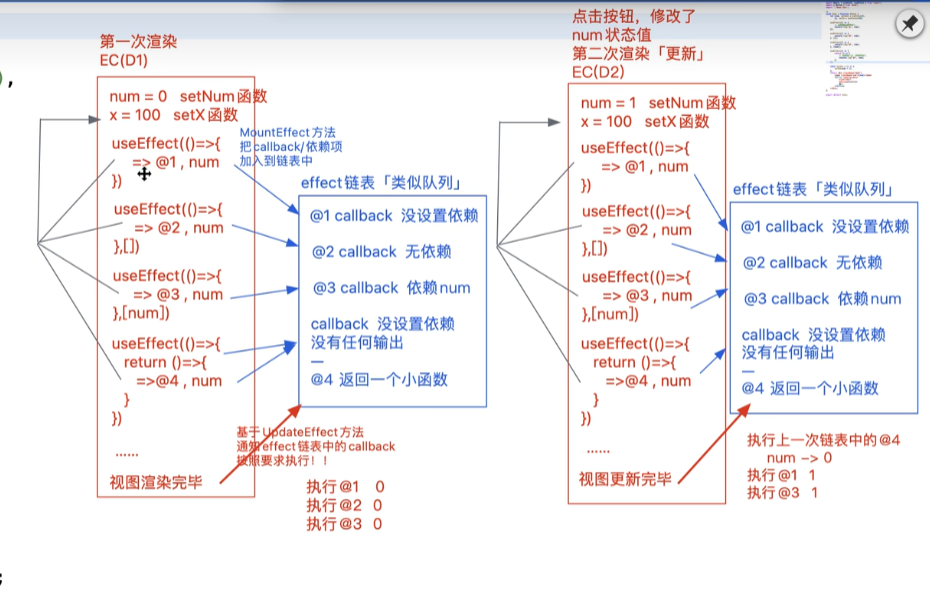

# React Hooks 之 useEffect 和 useLayoutEffect

## useEffect 的多种用法

```ts
const [counter, setCounter] = useState(0);
const [name, setName] = useState("xxx");

/* 依赖任何状态值变化 每次更新都会执行 */
useEffect(() => {});

/* 不依赖任何状态值变化 只有第一次渲染ComponentDidMount会执行一次 */
useEffect(() => {}, []);

/* 依赖状态值counter变化 只有counter触发的更新都会执行 */
useEffect(() => {}, [counter]);

/* 依赖状态值name变化 并且返回的清楚函数会在组件卸载时执行 */
useEffect(() => {
  /* 获取当前name的最新值 */
  return () => {
    /* 这里可以获取到上一次name的状态值 */
  };
}, [name]);
```

## useEffect 执行顺序

```ts
useEffect(() => {
  console.log("current", counter);

  return () => {
    console.log("destory", counter);
  };
}, [counter, name]);
```

1. 组件第一次加载，首先执行 render 函数
2. 组件 dom 加载完成，执行 useEffect 的回调函数，此时输出当前组件函数作用域中的值 0
3. 返回的清除函数会被缓存起来，等待组件卸载时执行
4. 点击按钮，setCounter 执行触发组件渲染
5. 当前组件函数作用域销毁，执行清除函数，此时的 counter 还是去当前作用域查找，值为 0
6. 组件的重新渲染意味着函数重新执行也就是重新创建一个新的组件函数执行上下文
7. 执行新组件的 render 函数
8. 新组件函数上下文中还是会执行 useEffect 的回调函数，此时的 counter 已经是更新后的 counter 所以值为 1
9. 顺序就是：render-0-0-render-1

## useEffect 执行机制



1. 组件首次渲染，通过 mountEffect 收集每一个 effect 回调函数，链表结构
2. 组件 dom 挂载完毕，调用 updateEffect 依次执行队列中的函数
3. 组件更新，生成一个新的上下文
4. 重新收集依赖
5. 组件新的 dom 更新完毕，首先执行清除函数，读取上一个上下文闭包中的值
6. 然后基于依赖队列的值，依次执行队列中的函数

## useEffect 注意事项

1. useEffect 必须在函数的顶级作用域中使用，不可以使用在循环以及条件判断等语句中

下面这种写法是错误的：

```ts
if (num > 10) {
  useEffect(() => {});
}
```

应该将条件判断加入到回调函数中才是正确的写法：

```ts
useEffect(() => {
  if (num > 10) {
    /* 业务逻辑 */
  }
});
```

2. useEffect 中可以不返回任何值，如果返回那么必须返回一个函数

我们常见的基于 useEffect 来实现 dom 加载完成之后发送网络请求的写法，如果基于 async 写这种写法是错误的，因为它默认返回了一个使用 promise 包裹的 undefined：

```ts
useEffect(async () => {
  const res = await axios.get();
});
```

我们可以修改为普通的 promise.then 的写法：

```ts
useEffect(() => {
  axios.get().then((res) => {
    console.log(res);
  });
});
```

或者我们可以使用 async 但是自己定义一个触发函数：

```ts
useEffect(async () => {
  const getData = async () => {
    const res = await axios.get();
  };
  getData();
});
```

## useLayoutEffect 和 useEffect 区别

```ts
useEffect(() => {
  console.log("useEffect执行");
});

useLayoutEffect(() => {
  console.log("useLayoutEffect执行");
});
```

我们首先来过一遍组件的渲染流程：

1. 基于 babel 将 jsx 编译为 createElement 函数调用的格式返回
2. react-dom 会将 createElement 执行，创建出虚拟 dom 对象
3. 基于 root.render 方法将虚拟 dom 对象创建出一个个的真实 dom 对象
4. 浏览器触发重绘和重排操作，也就是进入浏览器的渲染流水线
5. 浏览器渲染完毕

上面 5 步操作中：

useEffect 的回调函数会在浏览器渲染完毕之后才执行；
useLayoutEffect 具有阻塞浏览器重绘的效果，所以在第四步就会执行回调函数，在回调函数执行完成之后才会去渲染真实 dom

所以：
useLayoutEffect 一定比 useEffect 的回调函数首先执行，它的优点是当组件中出现计算元素位置大小等布局属性的需求时，总会等到最终的计算完成之后再去渲染真实的 dom，所以不会出现渲染时的闪烁效果；但是 useEffect 由于每次都只会在 dom 布局计算完毕一次渲染出来之后才去执行，因此频繁执行就会出现闪烁效果。但是 react 官方文档提到，不要过度使用 useLayoutEffect 因为它会阻塞浏览器的重绘操作，这会造成浏览器的渲染性能下降。
