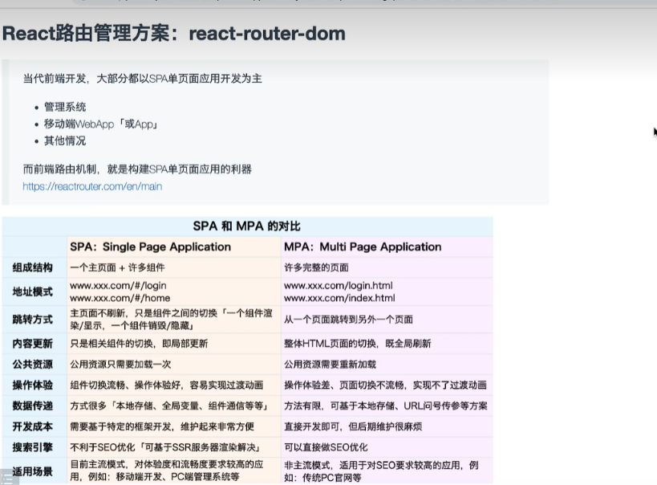

# React Router V5

## SPA 和 MPA 的对比



## 前端路由的技术选型

### Hash 路由

1. 改变页面的 hash 值，页面不会进行刷新
2. 页面的 hash 值发生变化，通过 onhashchange 监听变化，来匹配路由表中要渲染的组件
3. 前端通过 location.hash 获取到页面的 hash 值，比如"#/app"
4. 刷新页面不会 404，这是因为 hash 值不会被发送到服务器
   下面是一个简单的 hash 路由的实现：

```html
<div class="nav-header">
  <a href="#/">首页</a>
  <a href="#/about">关于</a>
  <a href="#/personal">个人中心</a>
</div>

<div class="router-view"></div>

<script>
  const routerView = document.querySelector(".router-view");

  const routes = [
    {
      path: "/",
      component: "这是首页要渲染的内容",
    },
    {
      path: "/about",
      component: "这是关于要渲染的内容",
    },
    {
      path: "/personal",
      component: "这是个人中心要渲染的内容",
    },
  ];

  const routerMatch = () => {
    const hash = location.hash.substring(1);

    let matched = routes.find((route) => {
      return route.path === hash;
    });

    if (matched) {
      routerView.innerHTML = matched.component;
    }
  };

  location.hash = "#/";
  routerMatch();

  window.onhashchange = routerMatch;
</script>
```

### History 路由

1. 通过 H5 新增的 History Api 实现页面间地址 path 的切换，页面不会进行刷新
2. 页面的 path 值发生变化，可以通过 History API 实现
3. 通过 window.onpopstate 来实现页面间 path 的变化，注意只有 go、forward、back、点击前进或后退行为可以触发此事件
4. 通过 pushState 或者 replaceState 无法被监听到 所以需要手动来进行一次路由匹配
5. 通过 location.pathname 可以获取页面的 path
6. 刷新页面会 404 这是因为路径 path 被当作资源地址一起发送给了服务器，需要 nginx 配置

下面是一个 History 路由的简单实现：

```html
<div class="nav-header">
  <a href="/">首页</a>
  <a href="/about">关于</a>
  <a href="/personal">个人中心</a>
</div>

<div class="router-view"></div>
<script>
  const routerView = document.querySelector(".router-view");
  const navHeader = document.querySelector(".nav-header");

  navHeader.addEventListener("click", (e) => {
    if (e.target.tagName === "A") {
      e.preventDefault();
      history.pushState({}, "", e.target.href);
      routerMatch();
    }
  });

  const routes = [
    {
      path: "/",
      component: "这是首页要渲染的内容",
    },
    {
      path: "/about",
      component: "这是关于要渲染的内容",
    },
    {
      path: "/personal",
      component: "这是个人中心要渲染的内容",
    },
  ];

  const routerMatch = () => {
    const path = location.pathname;

    let matched = routes.find((route) => {
      return route.path === path;
    });

    if (matched) {
      routerView.innerHTML = matched.component;
    }
  };

  /* 默认匹配/路由 */
  history.pushState({}, "", "/");
  routerMatch();

  window.onpopstate = (e) => {
    console.log({ e });
    routerMatch();
  };
</script>
```

## React Router V5 版本

1. HashRouter 或 BroswerRouter 开启路由
   所有渲染的内容都必须包裹在此组件中
2. Route 渲染容器占位组件
   每次页面加载或者路由切换完毕 都会基于当前 hash 或者 pathname 进行匹配，把匹配到的组件放到 Route 容器渲染
3. Link 导航组件
   会自动基于 to 的值来处理 hash 和 history 的跳转，渲染为一个 a 标签

4. Switch 组件
   默认是模糊匹配，只要匹配到一个还会继续匹配
   Switch 组件包裹的容器是只要匹配到就不在继续匹配

5. exact 精准匹配属性
6. Redirect 重定向组件
7. render 渲染函数 可以自定义当路由匹配之后的渲染逻辑，需要返回一个 JSX 组件

## 多级路由表的构建和配置

每一次路由跳转和页面加载：

1. 先从一级路由开始匹配
2. 先把匹配到的组件渲染出来
3. 匹配到的组件中如果又包含了 Route 或者 Redirect 组件
4. 那么接着匹配二级路由
5. 如果匹配到进入二级路由匹配的组件
6. ...依次类推 渲染多级组件

构建路由表：

```js
/**
 * 1. redirect
 * 2. to
 * 3. from
 * 4. exact
 * 5. path
 * 6. component
 * 7. name
 * 8. meta
 * 9. children
 */
const routes = [
  {
    redirect: true,
    exact: true,
    from: "/",
    to: "/home",
  },
  {
    path: "/home",
    component: Home,
    name: "Home",
    meta: {},
    children: homeRoutes,
  },
  {
    path: "/about",
    component: About,
    name: "About",
    meta: {},
  },
  {
    path: "/user",
    component: User,
    name: "User",
    meta: {},
  },
];
```

遍历路由表，生成路由配置：

```JS
import { Route, Switch, Redirect } from "react-router-dom";
import Page404 from "../views/V5Router/404";
import { Suspense } from "react";
const RouterView = (props) => {
  const { routes } = props;

  return (
    <Switch>
      {routes.map((route, index) => {
        const {
          redirect,
          to,
          from,
          exact,
          path,
          component: Component,
          name,
          meta,
        } = route;

        let routeProps = {};
        if (exact) routeProps.exact = exact;
        if (meta) routeProps.meta = meta;
        if (name) routeProps.name = name;

        if (redirect) {
          if (from) routeProps.from = from;
          return <Redirect key={index} {...routeProps} to={to}></Redirect>;
        }

        return (
          <Route
            key={index}
            {...routeProps}
            path={path}
            render={() => (
              <Suspense fallback={<>组件加载中</>}>
                <Component></Component>
              </Suspense>
            )}
          ></Route>
        );
      })}
      <Route path="*" component={Page404}></Route>
    </Switch>
  );
};

export default RouterView;

```

## 路由懒加载

1. React.lazy 函数
2. import()动态导入
   会返回一个 promise，resolve 的值是一个包含 defaault 属性的对象，default 属性指向的值就是组件代码被 babel 编译之后的 js
3. Suspense 异步组件
4. fallback 属性 指定异步加载期间渲染组件
5. webpackChunkName 组件打包分包的名称

## 获取路由对象信息的 N 种办法

在 React-Router-Dom 5.0 版本中，只要是被 HashRouter 或者 BroswerRouter 包裹,并且每一个被 Route 组件渲染的组件，都会默认传递三个属性：

1. history
2. location
3. match

如果直接渲染，那么可以直接基于 this.props 或者 props 属性获取：

```js
// A 组件的 porps 上就会有以上三个属性
<Route path="/a" component={A}></Route>
```

如果是被 render 函数渲染的，那么这三个属性会传递给 render 函数的参数：

```js
// B 组件的 porps 上就会有以上三个属性
<Route path="/a" render={(props) => <B {...props} />}></Route>
```

### 函数式组件

在函数式组件中：

如果组件是基于 Route 组件匹配后渲染的，可以通过 2 种方法获取路由参数信息：

1. 函数的 props 参数中解构
2. 通过 useHistory、useLocation、useRouteMatch Hooks 方法

函数式组件但是这个组件不是基于 Route 组件匹配渲染的，那么可以通过 2 种方法获取路由参数信息：

1. hooks 函数
2. 通过 withRouter 包裹高阶组件代理下

### 类组件中

1. 如果被 Route 包裹，可以直接通过 this.props 获取
2. 如果没有被 Route 包裹，那么可以通过 withRouter 包裹高阶组件

```js
import React from "react";
import { useHistory, useLocation, useRouteMatch } from "react-router-dom";

class Footer extends React.Component {
  render() {
    console.log(this.props);
    return <h1>Footer组件</h1>;
  }
}

/**
 * WithRouter高阶组件的实现原理
 * @param {*} Component
 * @returns
 */
function WrapperRouter(Component) {
  return function Hoc(props) {
    const history = useHistory();
    const location = useLocation();
    const match = useRouteMatch();

    console.log({
      history,
      location,
      match,
    });
    return (
      <Component
        {...props}
        history={history}
        match={match}
        location={location}
      ></Component>
    );
  };
}

export default WrapperRouter(Footer);
```

## 路由跳转方案

### 组件式导航

1. Link 组件
   会默认渲染为一个 a 标签，基于 a 标签的 href 来实现哈希路由导航，对 history 路由 react 在内部通过阻止默认事件的方式手动实现了路由的跳转
2. NavLink 组件
   用法和 Link 一样，但是会给默认匹配到的这一个 a 标签添加一个 active 的类名，便于我们修改选中的样式
   我们可以手动通过 activeClassName 来指定选中时的类名

组件式导航的三种导航方案：

```jsx
<Link to="/a">A</Link>

<Link to={{
  pathname:"/a",
  search:"?name=lilei&age=18",
  state:{}
}}>A</Link>

<Link to="/a" replace>A</Link>
```

### 编程式导航

```jsx
history.push("/a");

history.push({
  pathname: "/a",
  search: "?name=lilei&age=18",
  state: {},
});

histroy.replace("/a");
```

## 路由传递参数方案

### 1. 问号传递参数

- 传递的信息会出现在地址栏，有长度限制
- 传递的信息会在页面刷新的时候保留
- 需要自己手动通过 qs 库处理为 urlencoed 字符串

```js
history.push({
  pathname: "/a",
  search: qs.stringify({
    name: "lilei",
    age: 18,
  }),
});

history.push("/a?name=lilei&age=18");
```

传递过去如何接受呢？

1. useLocation 获取到 location 对象，然后从 location.search 取出，并通过 qs.parse 进行解析
2. 通过 new URLSearchParams(location.search).get()方法获取

### 2. path 动态参数

- 存在长度和安全的限制
- 组件刷新，地址中的信息仍然存在

首先需要在定义路由表的时候就定义为动态路由：

1. 精确动态参数

```js
{
  path: "user/:id/:name";
}
```

2. 模糊动态参数，需要加一个?

```js
{
  path: "user/:id?/:name?";
}
```

跳转的时候：

```js
history.push("/user/100/lilei");
```

获取的时候：

1. 通过 match.params 获取
2. 通过 useParams hooks 获取

### 3. state 隐式传参

- 信息不会出现在路由的地址中 美观 安全 没有长度限制
- 组件刷新 信息会丢失

跳转的时候：

```js
history.push({
  pathname: "/a",
  state：{
    name:"lilei",
    age:18
  }
});
```

获取的时候：

1. 通过 location.state 获取
