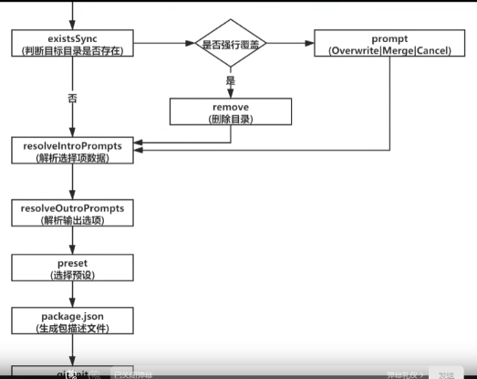
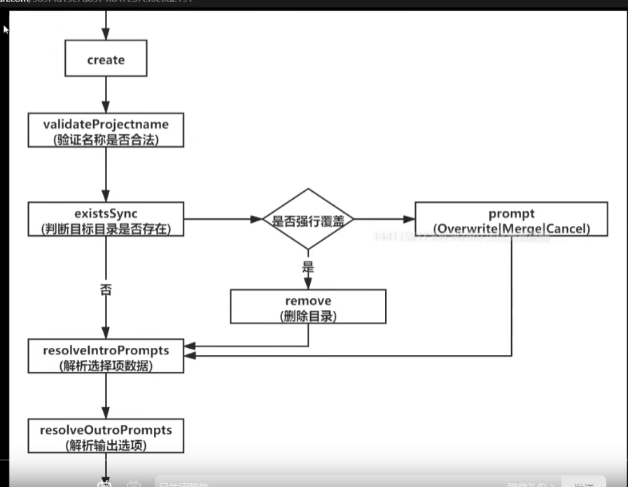
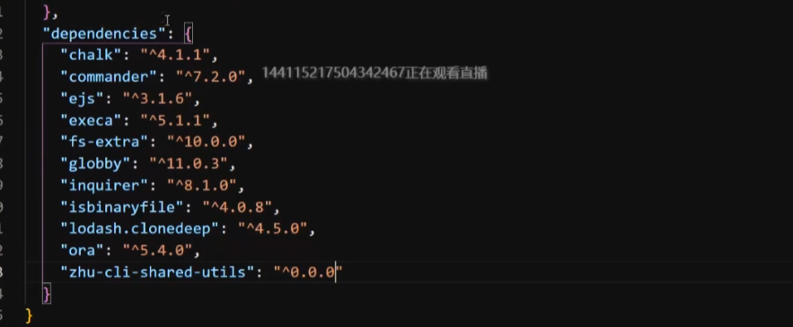

## 配置

https://github.com/staven630/vue-cli4-config

## 流程

## 配置

{
"name": "root",
"private": true,
/_ packages 目录下的所有目录都是 yarn 的工作空间 _/
"workspaces":[
"packages/*"
],
"devDependencies": {
"lerna": "^4.0.0"
}
}

## 源码流程
