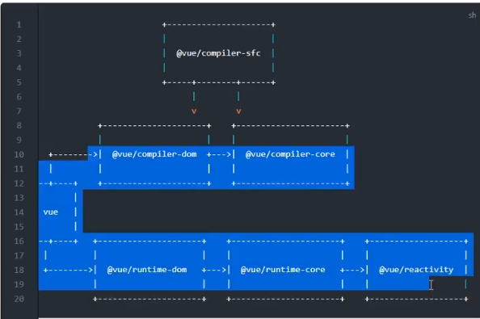

# Vue3.0 架构设计

1. 依旧采用声明式的编程范式，相比于命令式编程范式，更加接近用户编程习惯
2. 依旧采用虚拟 DOM 并采用了更加高效的 DIff 算法
3. 保留了编译时和编译运行时，用户编写代码时不可能都用虚拟 DOM 来描述 UI 和状态，此时就需要编译时先见将模板编译为虚拟 DOM，然后交给运行时将虚拟 DOM 渲染为真实 UI
4. 提供了良好的 TypeScript 支持

## Vue3 设计思想

1. 模块拆分，更加适合现代构建工具的 Tree Shaking
   Vue3.0 更注重模块上的拆分，在 2.0 中无法单独使用部分模块。需要引入完整的 Vuejs(例如只想使用使用响应式部分，但是需要引入完整的 Vuejs)， Vue3 中的模块之间耦合度低，模块可以独立使用。

2. 重写 Api
   Vue2 中很多方法挂载到了实例中导致没有使用也会被打包（还有很多组件也是一样）。通过构建工具 Tree-shaking 机制实现按需引入，减少用户打包后体积。

3. 自定义渲染器
   Vue3 允许自定义渲染器，扩展能力强。不会发生以前的事情，改写 Vue 源码改造渲染方式。 扩展更方便

4. 采用 Monorepo 管理项目
   Monorepo 是管理项目代码的一个方式，指在一个项目仓库(repo)中管理多个模块/包(package)。 Vue3 源码采用 monorepo 方式进行管理，将模块拆分到 package 目录中。

- 一个仓库可维护多个模块，不用到处找仓库
- 方便版本管理和依赖管理，模块之间的引用，调用都非常方便

## 框架的取舍

## Vue3.0 源码结构

```bash
@vue
├── compiler-core       与运行平台无关的编译器核心代码
├── compiler-dom        针对浏览器的编译模块
├── compiler-sfc        针对sfc单文件解析
├── compiler-ssr        针对服务端渲染的编译模块

├── reactivity          最核心的响应式
├── reactivity-transform

├── runtime-core        与平台无关的运行时核心
├── runtime-dom         针对浏览器的运行时模块
├── server-renderer     服务端渲染模块

└── shared              多个包之间共享的模块

```

## v3.0.5 项目结构

vue

- @vue/compiler-sfc
- @vue/compiler-dom
  - @vue/compiler-core
- @vue/runtime-dom - @vue/runtime-core - @vue/reactivity
  
