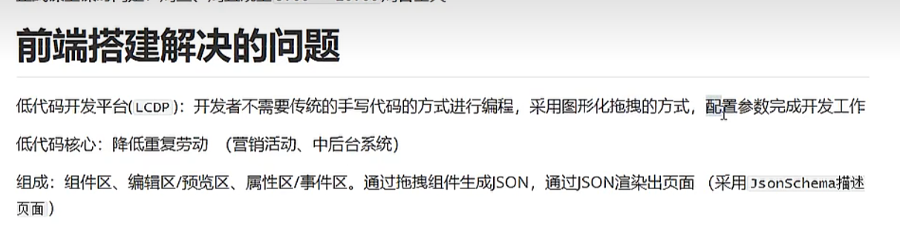

# 从零实现前端低代码平台

## 组成

组件区 物料
属性区 事件区
编辑区
导出的 JSON 来描述渲染的页面 jsonSchema

## jsx 的用法

https://zhuanlan.zhihu.com/p/678556220

## 流程

1. 构造假数据 实现基于 json

## 重大 bug

vue 更新的 key
删除第一个 由于 key 都是 undefined
所以明明删除的是第一个
before[a,b,c]

但是却删除了最后一个

删除前有 3 个 dom 结构
删除之后 list 只有 2 个，但是 Vue 不想把 3 个 dom 结构全部删除了再来重新创建 2 个
所以它会最大程度复用 dom，也就是 dom 不会重新创建
此时会将删除的那一项的 dom 结构删除
此时页面上有 2 个 dom
然后将当前列表 list 中的值比如文本，赋值到已经有的 2 个 dom 上

## 没有 key 的：就地更新策略

如果数据项的顺序被改变，Vue 将不会移动 DOM 元素来匹配数据项的顺序，而是就地更新每个元素，并且确保它们在每个索引位置正确渲染。

1. 用户点击删除第一项
2. list 从 3 项变为 2 项
3. 发现 diff 一个 此时从尾部删除掉 1 个 dom 结构
4. 然后拿到剩余的 2 项的数据 依次更新到已有的 dom 上的 text 中
5. 给人造成的视觉效果就是最后一个 dom 从元素上删除了

只会更新 html 元素的属性，input 框的 value 属性是和 dom 绑定在一起的，所以还是会保留

1. dom 结构其实没有删
2. 更新的是 dom 的元素属性
3. 由于 value 是和 dom 绑定的 所以 dom 没有删 value 还在

## 分析问题

更新前：
【文本，按钮，input】
删除第一个：

1. 文本和按钮的 dom 结构并没有删除
2. list 从 3 变为 2
3. 尾部删除掉一个 dom 结构 此时表现为把 input 数据框删除了
4. 列表中第一个 dom 不更新绑定的文本，只更新 html 属性，此时第一个 dom 的 left 和 to 属性更新呢
5. 列表中第二个 dom 也不更新绑定的文本，只更新呢 left 和 top 的值
6. 第一个和第二个 dom 元素被复用了，复用的原因是没有传递 key，vue 认为可以尽可能的不去删除 dom 重新创建
7. 而是直接从头开始留 2 个 dom，从尾部将 dom 移除，删除的操作非常快
8. 留下 dom 之后你得部署数据上去啊，从第一个列表中拿出数据，然后更新元素的属性

## 导入之后的 id 问题

## 项目亮点

1. 公司的项目尤其是后台管理系统多数存在频繁的拷贝和重写以及依赖的重新安装

- 依赖需要重新安装
- 公共组件需要拷贝
- 公共方法需要拷贝
- 公共的 service
- 字体以及 icon 需要拷贝
- http 的封装
  以上这些都可以直接基于一个脚手架模板来生成，这样子的好处是可以大大减少项目的执行流程
  配置 cicd 流水线 代码提交触发流水线部署

2. 基于 handbutes 模板引擎实现了一套可以自动生成项目目录的功能

- 权限后台配置菜单，配置前端匹配的组件目录
- 终端启动 handlebutes
- 选择目录
- 执行可以快速生成一个后台模板 省去了重新复制粘贴的步骤
- 并且支持后端的 swigger 路径 发起 http 请求 自动生成一份接口文档的配置放入到项目中
- 大大减少了 开发 crud 界面的速度

3. 项目规范方面的自动化工具的导入

## 项目难点

前端低代码搭建平台的开发，项目提出了需求
拿到了配置好的 json
生成对应的 vue 文件
然后基于 webpack 进行打包

1. 可以用于快速收集园区工人的基本信息
2. 快速收集园区招聘的需求
3. 收集园区污染物信息

## 项目难点 设计了一个前端监控系统

监听业务的系统报警

## 公司内部的组件库 Vue3.0

1. 因为是和业务强耦合的
2. 不需要每次都自己去复制一遍
3. 锻炼自己的能力

## hard 实力

Vue Pinia
Vue Router
